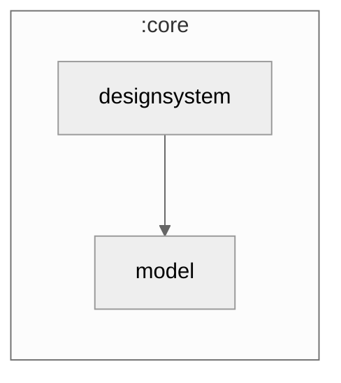

### Module Graph

```mermaid
%%{
  init: {
    'theme': 'neutral'
  }
}%%

graph LR
  subgraph :core
    :core:designsystem["designsystem"]
    :core:model["model"]
  end
  :core:designsystem --> :core:model
```