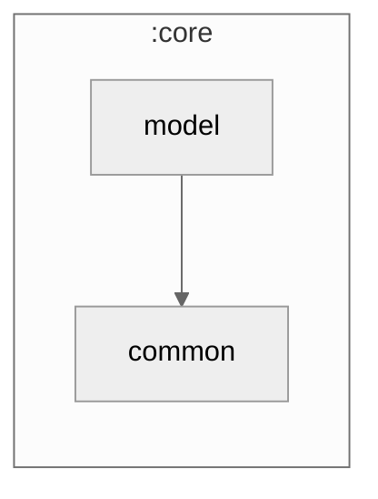
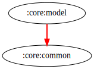

### Module Graph

```mermaid
%%{
  init: {
    'theme': 'neutral'
  }
}%%

graph LR
  subgraph :core
    :core:model["model"]
    :core:common["common"]
  end
  :core:model --> :core:common
```
# :core:model module
## Dependency graph

