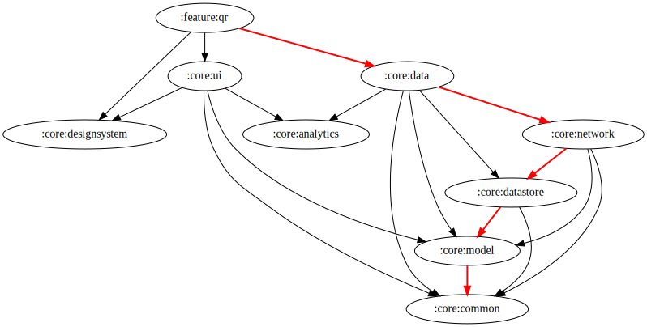

# QR Scan Feature - In Progress

This feature allows users to scan QR codes and perform actions to send payment.
currently, this feature only available in Android & IoS platform.# :feature:qr module
## Dependency graph

