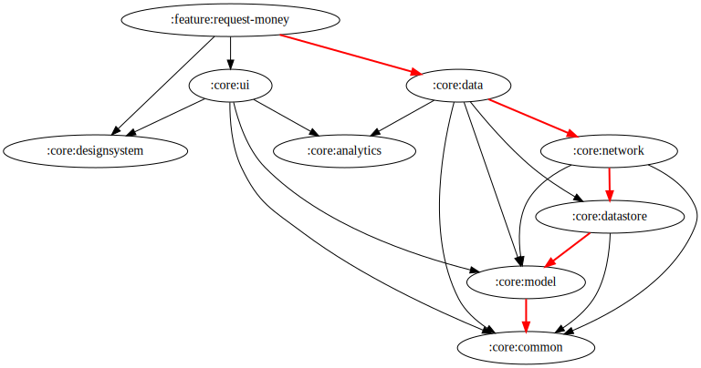

### iOS: Add the following keys to the Info.plist in your Xcode project:

```
<key>NSCameraUsageDescription</key><string>$(PRODUCT_NAME) camera description.</string>
<key>NSPhotoLibraryUsageDescription</key><string>$(PRODUCT_NAME) photos description.</string>
```
# :feature:request-money module
## Dependency graph

