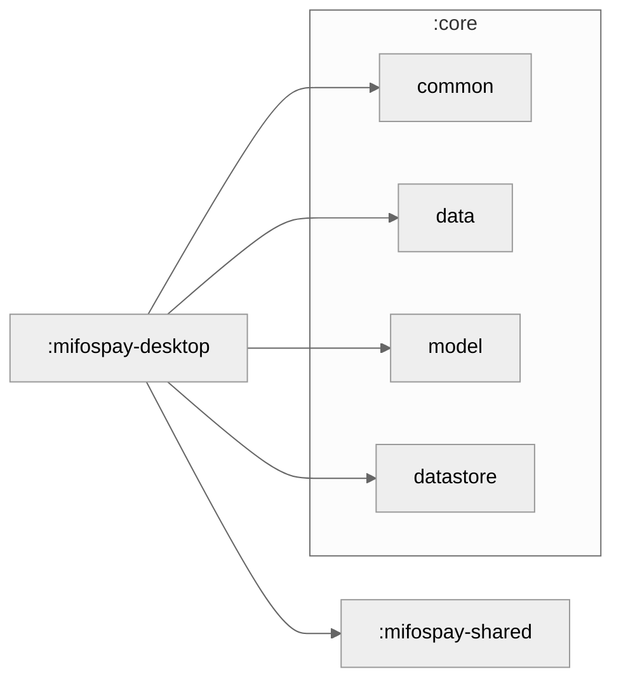
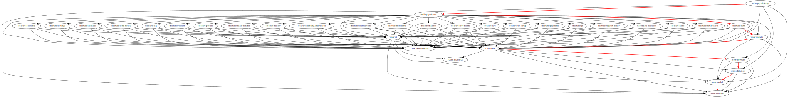

### Module Graph

```mermaid
%%{
  init: {
    'theme': 'neutral'
  }
}%%

graph LR
  subgraph :core
    :core:common["common"]
    :core:data["data"]
    :core:model["model"]
    :core:datastore["datastore"]
  end
  :mifospay-desktop --> :core:common
  :mifospay-desktop --> :core:data
  :mifospay-desktop --> :core:model
  :mifospay-desktop --> :core:datastore
  :mifospay-desktop --> :mifospay-shared
```
# :mifospay-desktop module
## Dependency graph

